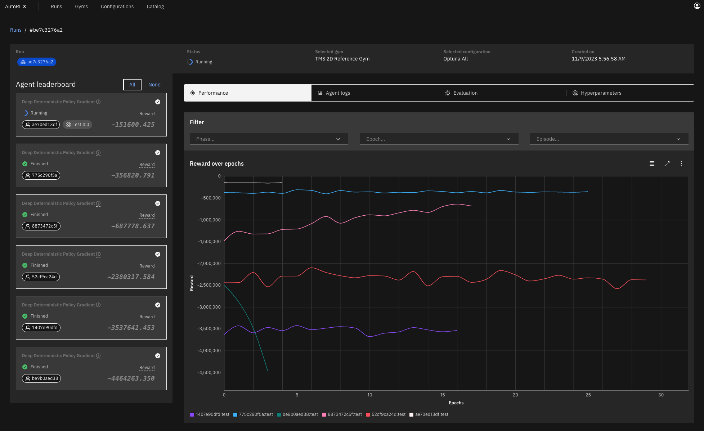

# Welcome to AutoRL X 👋

Interactive Platform for Automated Reinforcement Learning on the Web



With Auto RL X you can interactively create reinforcement learning gyms, execute optimization runs and visually inspect agent performance directly in your browser. 🖥 📊 🤖 

AutoRL X is provided under GPL 3.0 license.

The code base further depends on:

- https://github.com/lorifranke/arlo.git (a fork of https://github.com/arlo-lib/ARLO)
- https://github.com/lorifranke/mushroom-rl.git (a fork of https://github.com/MushroomRL/mushroom-rl)

## Installation
This will deploy a MySQL database, AutoRL X Server and the AutoRL X web interface in your local Docker environment using Docker Compose.

### Prerequisites 🐳

Install [Docker](https://www.docker.com/) from https://www.docker.com/. 

### 🟢 Deploy
From your terminal, to pull and deploy prebuilt images, execute
```shell
sh deploy_by_pull.sh    # Deploys prebuilt images and starts the composition
```
Alternatively, to build and deploy images locally, execute
```shell
sh deploy_by_build.sh   # Builds locally, deploys and starts the composition
```
Don't hesitate to [open an issue](https://github.com/lorifranke/autorlx/issues/new) if you need help.

### 🟡 Restart
After deployment, to stop and restart the composition, execute 
```shell
sh stop.sh              # Stops the composition
sh start.sh             # Starts the compositions
```

### 🔴 Undeploy
From your terminal, execute
```shell
sh undeploy.sh          # Stops and undeploys the composition
```


## Developers

#### Run AutoRL X Server w/ Python:

```shell
cd server
pip install .           # Installs dependencies
python main.py &        # Listens to port 8000
```

#### Run AutoRL X w/ NPM:

```shell
cd ..
npm install             # Installs dependencies
npm run dev &           # Listens to port 5173
```

## How to cite us:
```
@inproceedings{franke2024autorlx,
title= {AutoRL X: Automated Reinforcement Learning on the Web},
author={Franke, L. and Weidele, D. and Dehmamy, N. and Lipeng, N. and Haehn, D.},
booktitle={Special Issue of the IUI 2023, ACM Journal Transactions on Interactive Intelligent Systems},
year={2024},
organization={ACM}
}
```
